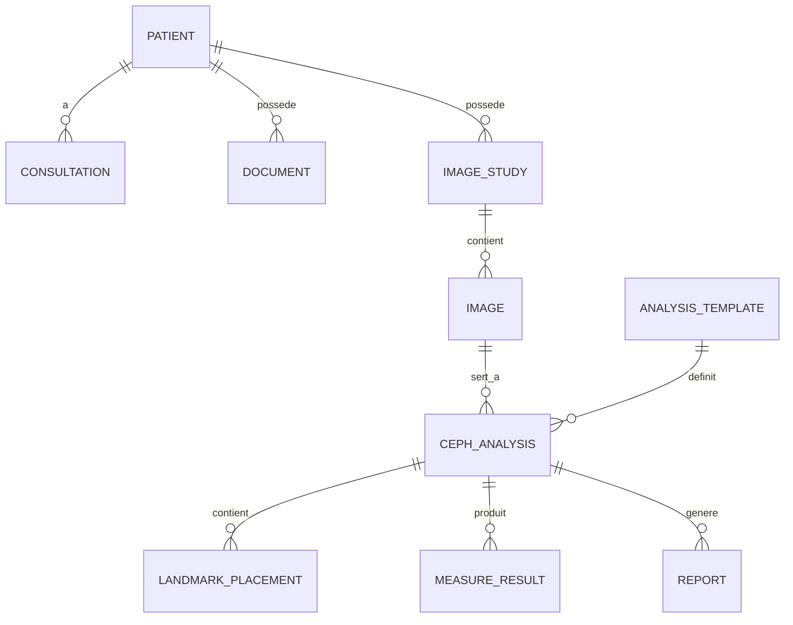

# Architecture technique — Logiciel d'orthodontie (vision CTO)

> Document compagnon de [plan.md](plan.md). Découpage en sprints : [sprints.md](sprints.md).

## 1. Décisions structurantes

| # | Décision | Choix | Justification |
|---|----------|-------|---------------|
| D1 | Type d'application | **Desktop natif, offline-first** | Contrainte "fonctionnement local sans cloud" + confidentialité médicale. Pas de web app pour le MVP. |
| D2 | Framework UI | **Avalonia UI (.NET 10 LTS, MVVM)** | Cross-platform (Windows aujourd'hui, Linux/macOS demain), open source MIT, look moderne. WPF reste un fallback si un composant critique manque. |
| D3 | Inférence IA | **Entraînement en Python/PyTorch, export ONNX, inférence embarquée via ONNX Runtime** | Zéro dépendance Python chez le client. Un seul binaire à déployer, pas de serveur IA. |
| D4 | Base de données | **SQLite chiffré (SQLCipher) par défaut, PostgreSQL en option multi-poste** — via EF Core pour rester agnostique | Un cabinet solo ne doit pas administrer un serveur PostgreSQL. EF Core permet de basculer sans réécriture. |
| D5 | Stockage binaire (DICOM, photos, STL) | **Système de fichiers local structuré, derrière une interface `IObjectStore`** | MinIO est surdimensionné pour un poste isolé (et sa licence AGPL est à surveiller). L'abstraction permet d'ajouter un backend S3/MinIO pour la version clinique multi-poste. |
| D6 | Rendu 2D (céphalométrie) | **SkiaSharp** (canvas 2D performant, intégré à Avalonia) | Zoom/rotation/annotations/tracés = du 2D vectoriel. Pas besoin de VTK pour le MVP → réduit énormément le risque. |
| D7 | Rendu 3D (P1/P2) | **VTK en C++ derrière une couche d'interop, ou vtk.js dans une WebView — décision à trancher par un spike au Sprint 8** | Le wrapper .NET officiel (ActiViz) est **commercial** : c'est un piège de licence à ne pas découvrir en P2. |

## 2. Vue d'ensemble

```mermaid
graph TB
    subgraph Application Desktop [.NET 10 / Avalonia]
        UI[UI - Avalonia MVVM<br/>CommunityToolkit.Mvvm]
        APP[Couche Application<br/>cas d'usage, validation]
        subgraph Modules métier
            PAT[Patients]
            IMG[Import Imagerie<br/>fo-dicom / ImageSharp]
            VIS[Visualisation 2D<br/>SkiaSharp]
            CEPH[Céphalométrie<br/>moteur d'analyses]
            RPT[Rapports PDF<br/>QuestPDF]
            AI[IA Landmarks<br/>ONNX Runtime - P1]
            V3D[Viewer 3D STL/CBCT<br/>VTK - P1/P2]
        end
        INFRA[Infrastructure]
    end
    subgraph Persistance locale
        DB[(SQLite chiffré<br/>ou PostgreSQL)]
        FS[(Object Store fichiers<br/>DICOM, photos, STL)]
    end
    subgraph Pipeline IA - hors client
        TRAIN[Python / PyTorch<br/>entraînement + eval]
        ONNX[Modèle ONNX versionné]
    end
    UI --> APP --> Modules métier
    Modules métier --> INFRA
    INFRA --> DB
    INFRA --> FS
    TRAIN --> ONNX --> AI
```

### Structure de la solution

```
src/
  Ortho.Domain/          # Entités, analyses céphalométriques, normes — zéro dépendance
  Ortho.Application/     # Cas d'usage, DTOs, interfaces (IObjectStore, ILandmarkDetector…)
  Ortho.Infrastructure/  # EF Core, fo-dicom, object store fichiers, ONNX Runtime
  Ortho.UI/              # Avalonia, ViewModels, rendu SkiaSharp
  Ortho.Reporting/       # Templates QuestPDF
ml/                      # Pipeline Python (entraînement, export ONNX) — repo séparable
tests/
  Ortho.Domain.Tests/    # ⚠ les formules céphalométriques sont testées ici, exhaustivement
  Ortho.Integration.Tests/
```

**Règle d'or** : `Ortho.Domain` contient toutes les définitions d'analyses (Steiner, Ricketts, Tweed, McNamara, Downs, Jarabak) sous forme **déclarative** (landmarks requis → mesures → normes ± écart-type). Ajouter une analyse = ajouter des données, pas du code. C'est aussi ce qui rendra l'audit MDR possible.

## 3. Modules et bibliothèques open source

| Module | Bibliothèque | Licence | Remarques |
|--------|-------------|---------|-----------|
| UI desktop | [Avalonia UI](https://avaloniaui.net) | MIT | + `CommunityToolkit.Mvvm` (MIT) pour le MVVM |
| DICOM | [fo-dicom](https://github.com/fo-dicom/fo-dicom) | MS-PL | Référence .NET. Gère les transfer syntaxes courantes ; codecs JPEG2000 à valider tôt |
| Images JPG/PNG/TIFF | [ImageSharp](https://github.com/SixLabors/ImageSharp) | Six Labors Split License | **Gratuit sous ~1 M$ de CA** — OK startup, à re-vérifier en croissance. Fallback 100 % libre : SkiaSharp + LibTiff.Net |
| Rendu 2D / tracés | [SkiaSharp](https://github.com/mono/SkiaSharp) | MIT | Canvas GPU, intégration Avalonia native |
| Calculs géométriques | [MathNet.Numerics](https://numerics.mathdotnet.com) | MIT | Angles, distances, transformations, superpositions |
| PDF | [QuestPDF](https://www.questpdf.com) | Community (gratuit < 1 M$ CA) | Fallback 100 % libre : PDFsharp (MIT) |
| ORM / DB | EF Core + [SQLCipher via SQLitePCLRaw](https://github.com/ericsink/SQLitePCL.raw) / Npgsql | MIT / PostgreSQL | Chiffrement au repos dès le MVP |
| Logs / diagnostics | [Serilog](https://serilog.net) | Apache-2.0 | Journal d'audit des accès dossiers (exigence confidentialité) |
| Tests | xUnit + FluentAssertions | Apache-2.0/MIT | |
| **IA (P1)** — entraînement | PyTorch + [MMPose](https://github.com/open-mmlab/mmpose) (HRNet/heatmaps) + Albumentations | Apache-2.0/MIT | Datasets publics de démarrage : **ISBI 2015 Lateral Ceph Challenge**, **CEPHA29 / CL-Detection 2023** |
| **IA (P1)** — inférence client | [ONNX Runtime](https://onnxruntime.ai) | MIT | CPU par défaut, DirectML si GPU dispo |
| **STL (P1)** | VTK (BSD) via interop, ou [HelixToolkit](https://github.com/helix-toolkit/helix-toolkit) (MIT) si l'on reste simple | BSD / MIT | HelixToolkit suffit pour afficher/mesurer un STL ; VTK devient nécessaire au CBCT |
| **CBCT (P2)** | [VTK](https://vtk.org) (rendu volumique, MPR) + [ITK](https://itk.org)/[SimpleITK](https://simpleitk.org) | BSD / Apache-2.0 | ⚠ ActiViz (wrapper .NET de Kitware) est payant — voir risque R3 |
| **Fusion STL+CBCT (P2)** | [Elastix / ITKElastix](https://elastix.dev) | Apache-2.0 | Recalage rigide automatique + ajustement manuel |
| **Segmentation dents / setup (P3)** | [Open3D](http://www.open3d.org), PyTorch3D, [libigl](https://libigl.github.io) | MIT/BSD/MPL-2.0 | + littérature TSegNet/MeshSegNet pour la segmentation |

## 4. Modèle de données (MVP)



Points clés :
- `IMAGE` stocke les métadonnées + un pointeur vers l'object store (jamais de binaire en base) + **calibration** (mm/pixel, indispensable aux mesures).
- `LANDMARK_PLACEMENT` garde la provenance (`manuel` / `IA` + score de confiance + validé par praticien) — requis pour la traçabilité MDR.
- `ANALYSIS_TEMPLATE` : définition déclarative des 6 analyses, versionnée.
- Toute modification d'un dossier patient est journalisée (audit trail).

## 5. Risques techniques et mitigations

| # | Risque | Impact | Prob. | Mitigation |
|---|--------|--------|-------|------------|
| R1 | **Variabilité DICOM réelle** (transfer syntaxes exotiques, DICOM des céphalostats locaux mal formés, JPEG2000) | Import cassé chez les premiers clients | Élevée | Collecter dès le Sprint 0 un corpus de fichiers réels auprès de 3–5 cabinets tunisiens ; suite de tests d'import sur ce corpus ; fallback "import image + calibration manuelle" |
| R2 | **Précision des mesures** (calibration mm/pixel, erreurs d'arrondi, formules d'analyses divergentes selon les écoles) | Perte de confiance clinique immédiate | Élevée | Validation croisée avec un orthodontiste référent ; tests unitaires sur cas publiés dans la littérature ; affichage explicite de la calibration |
| R3 | **Licence ActiViz** : le wrapper .NET de VTK est commercial, découvert trop tard = P1/P2 bloqués ou coûteux | Budget / re-architecture | Moyenne | Spike dédié (Sprint 8) : comparer C++/CLI maison, vtk.js en WebView, HelixToolkit seul pour STL. Décision avant tout dev 3D |
| R4 | **IA : manque de données locales annotées** — les datasets publics (~400–1000 images) ne couvrent pas les appareils/populations locaux | Modèle décevant en cabinet | Élevée | Le MVP manuel devient l'outil d'annotation : chaque analyse validée = donnée d'entraînement (avec consentement). Fine-tuning progressif |
| R5 | **Performance CBCT** : volumes 500 Mo–2 Go sur des PC de cabinet modestes | Viewer inutilisable | Moyenne | Streaming/downsampling progressif, rendu GPU obligatoire, config minimale documentée, chargement hors UI thread |
| R6 | **Conformité MDR / logiciel dispositif médical** : la céphalométrie assistée est du DM classe IIa en Europe ; en Tunisie la DPM est plus légère mais l'export Maghreb/UE exigera le marquage | Interdiction de vente à terme | Moyenne (certaine à terme) | Dès maintenant : traçabilité (audit trail, provenance des landmarks), gestion de versions des analyses, documentation des exigences (IEC 62304-friendly). Ne pas viser le marquage CE au MVP, mais ne rien construire qui l'empêche |
| R7 | **Confidentialité** : données de santé sur des PC partagés, parfois sans mot de passe | Fuite de données, réputation | Élevée | Chiffrement au repos (SQLCipher + fichiers chiffrés AES), authentification applicative, verrouillage de session, sauvegardes chiffrées |
| R8 | **Licences "semi-libres"** (ImageSharp, QuestPDF : gratuites sous seuil de CA ; MinIO : AGPL) | Coût ou obligation de publication du code | Faible | Registre des licences tenu à jour ; fallbacks identifiés (PDFsharp, SkiaSharp, SeaweedFS/stockage fichiers) |
| R9 | **Équipe réduite vs largeur du produit** (desktop + imagerie + IA + 3D) | Retards en cascade | Élevée | Périmètre MVP strictement 2D ; jalons de démo toutes les 2 semaines avec un orthodontiste pilote ; P2/P3 non planifiés en détail tant que P0 n'est pas en production |
| R10 | **Migration de schéma chez les clients** (données locales, pas de contrôle centralisé) | Corruption de dossiers | Moyenne | Migrations EF Core testées + sauvegarde automatique avant toute mise à jour + versionnage du schéma dans le fichier |

## 6. Ce qu'on ne fait PAS au MVP (dette assumée)

- Pas de cloud, pas de synchronisation multi-cabinet (l'interface `IObjectStore`/EF Core prépare le terrain).
- Pas d'arabe (mais toutes les chaînes en `.resx` dès le premier écran, et layout testé en RTL une fois).
- Pas de marquage CE — seulement les fondations de traçabilité.
- Pas de 3D.
